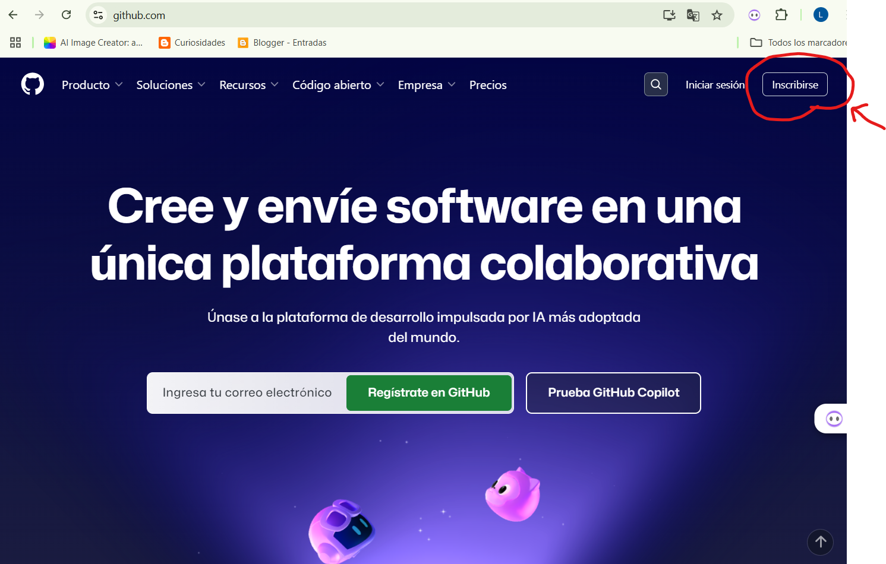
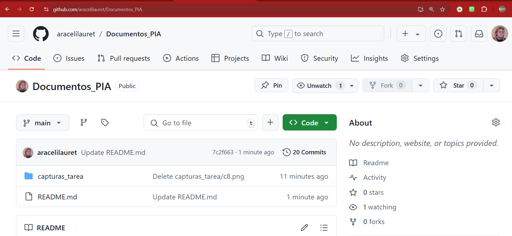
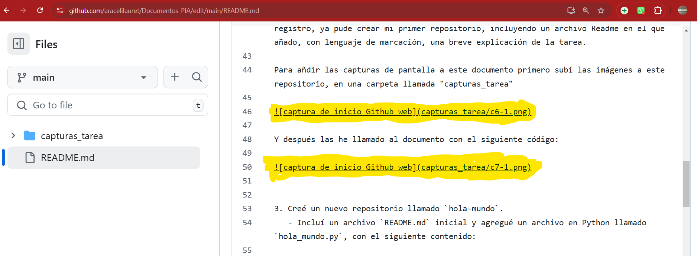
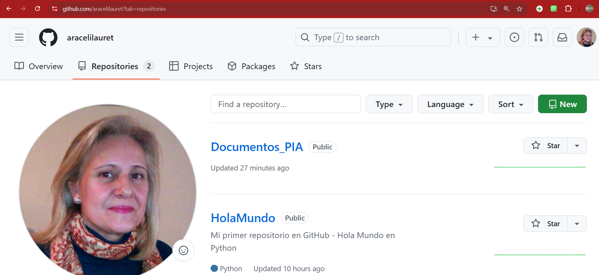

# Habilitando un perfil en el ecosistema de desarrollo de inteligencia artificial

## Unidad: 1  
**Curso de Especialización y Módulo:**  
_Inteligencia Artificial y Big Data - Programación en Inteligencia Artificial_

---

## Descripción de la tarea

En esta tarea se solicitó realizar las siguientes acciones:  
1. **Crear una cuenta en GitHub y configurar un repositorio con un archivo `README.md` y un archivo Python que imprima "Hola Mundo".**  
2. **Conectar con la comunidad en redes sociales (Twitter o LinkedIn) siguiendo los pasos indicados.**  

A continuación, se detallan los pasos realizados con sus respectivas capturas de pantalla y enlaces.

---

## Pasos realizados

### Apartado 1: Crear cuenta en GitHub y repositorio "Hola Mundo"
1. Accedí a la página web de [GitHub](https://github.com/) y me registré siguiendo los pasos indicados.
   
   
 
Para realizar el registro pinché en el botón de la parte superior derecha “Inscribirme”, ingresé mi dirección de correo (como ya tengo una cuenta con mi correo usé otra para mostrar el registro)


Añadí una contraseña segura con mayúsculas, minúsculas y un caracter especial, y me pidió un nombre de usuario y verificación con imágenes:


Me pidió un código de verificación enviado a mi correo:


Una vez introducido me redirige a la página de login:


No me pidió que especificase si soy alumna o profesora. Tras concluir el proceso de registro, ya pude crear mi primer repositorio, incluyendo un archivo Readme en el que añado, con lenguaje de marcación, una breve explicación de la tarea.

Para añdir las capturas de pantalla a este documento primero subí las imágenes a este repositorio, en una carpeta llamada "capturas_tarea"



Y después las he llamado al documento con el siguiente código:




3. Creé un nuevo repositorio llamado `hola-mundo`.  
   - Incluí un archivo `README.md` inicial y agregué un archivo en Python llamado `hola_mundo.py`, con el siguiente contenido:  

   ```python
   print("Hola Mundo")


Conclusión:

Ante la duda, y ya que tenía una cuenta previamente creada, quizá de cuando estudié ASIR, prefería seguir los pasos de la práctica y crearla de cero con otro correo electrónico, obviamnete la web ha cambiado en estos años.

No tenía muy claro si crear el README era aparte, con lo que mi repositorio tiene dos apartados, este primero de "Documentos_PIA" con un "Readme" donde muestro el proceso de registro, y uno aparte con el "Hola Mundo" que incluye su propio "README".

He aprendido a trabajar con Github, donde es imprescindible guardar los cambios y donde también se hace dificil borrar un archivo si está referenciado.

Finalmente he concluido el proceso exitosamente.


   

Y eso es todo, espero haber realizado la práctica correctamente.

Araceli Lauret
